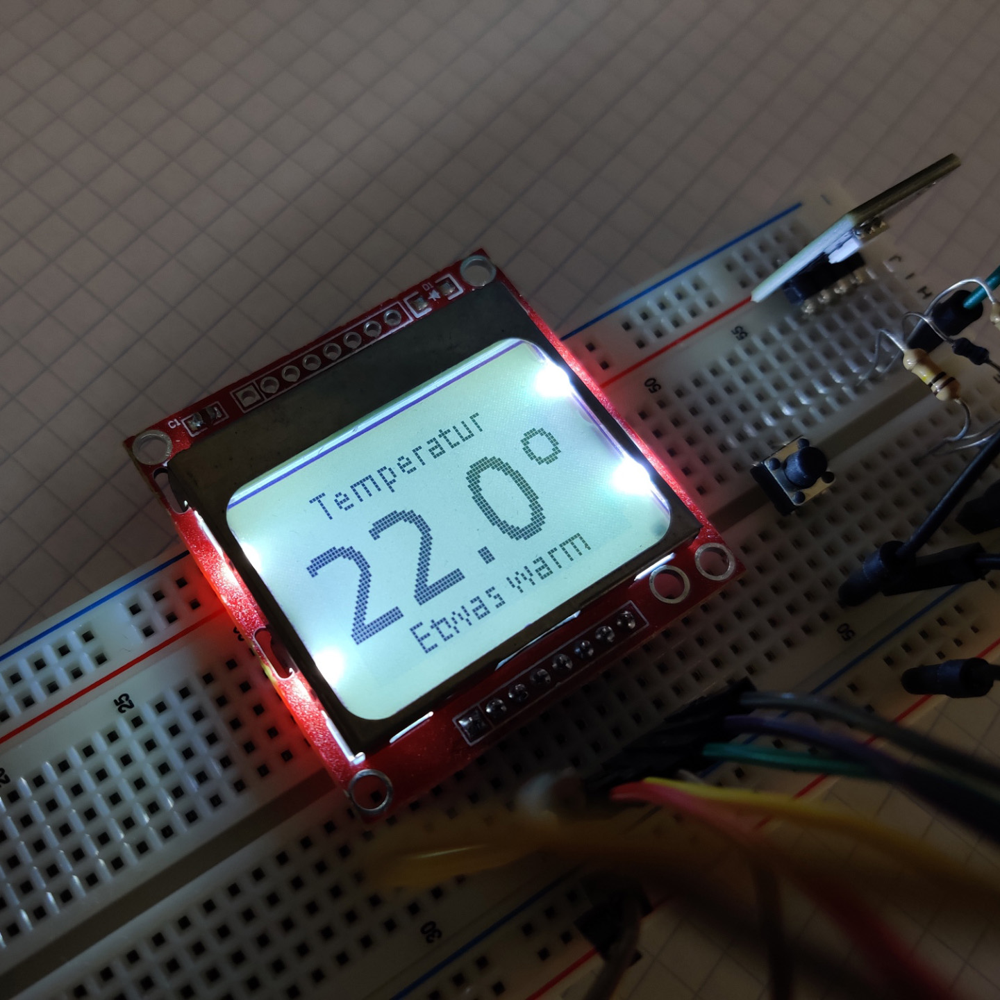
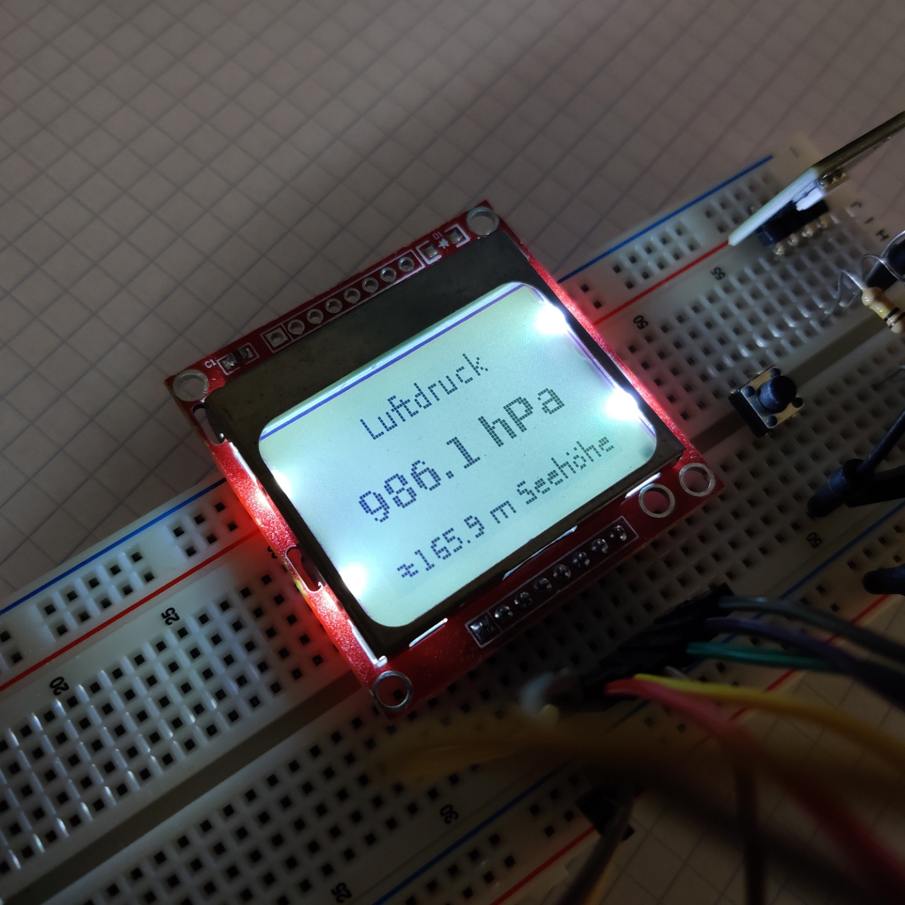
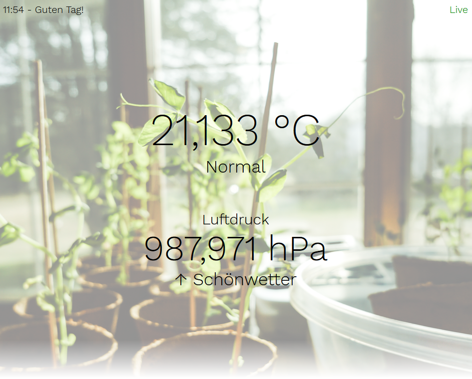
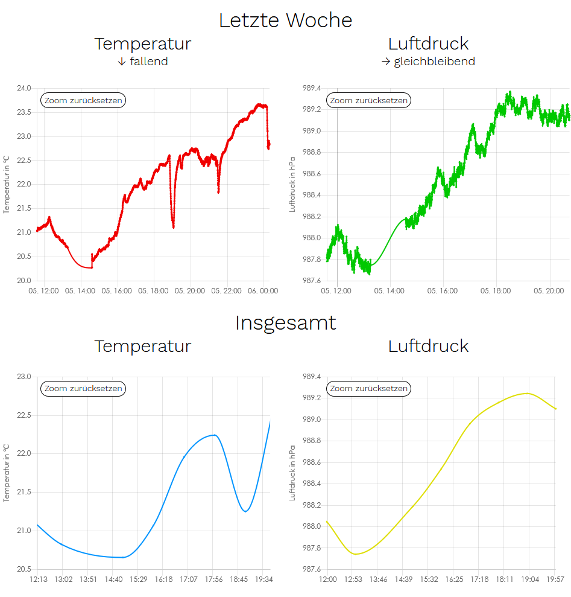
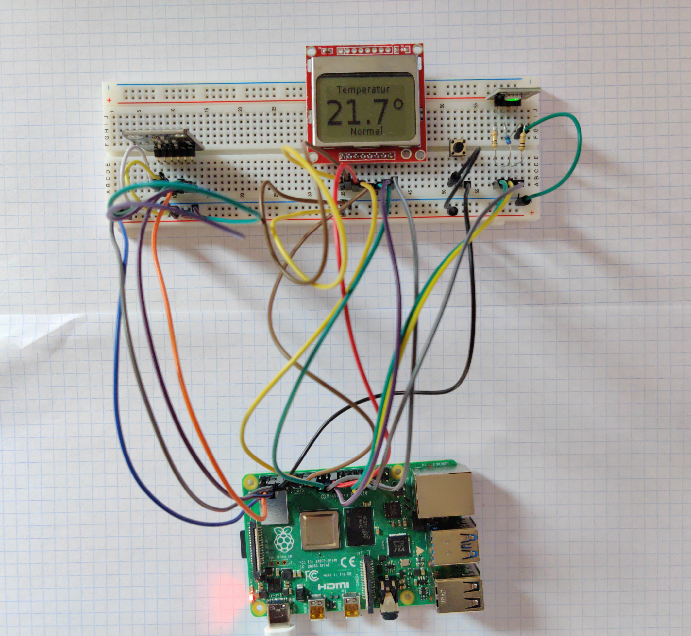

# Airinfo Pi
Airinfo Pi is a project that enables a Raspberry Pi to function as an indoor air measuring device with a display which shows the temperature and air pressure of a room and a website which contains additional information and charts.
As is it was initially made for school, please bear in mind that the primary language of the code is itself is German.

### Setup
To find out what you need to run this project on your Raspberry Pi, consider taking a look on the [setup page](documentation/setup.md).

### Additional information
The project is written in Python, HTML, CSS, JavaScript, PHP and MySQL with the help of these amazing tools.

Python:
- [Adafruit CircuitPython BMP280](https://github.com/adafruit/Adafruit_CircuitPython_BMP280) by Adafruit Industries - [Software License Agreement (BSD License)](https://github.com/adafruit/Adafruit-PCD8544-Nokia-5110-LCD-library/blob/master/license.txt)
- [Adafruit PCD8544 Nokia 5110 LCD Library](https://github.com/adafruit/Adafruit-PCD8544-Nokia-5110-LCD-library) by Adafruit Industries - [Software License Agreement (BSD License)](https://github.com/adafruit/Adafruit-PCD8544-Nokia-5110-LCD-library/blob/master/license.txt)
- [RPi.GPIO](https://pypi.org/project/RPi.GPIO/) by Ben Croston - [MIT License](https://github.com/Tieske/rpi-gpio/blob/master/LICENCE.txt)
- [CircuitPython](https://github.com/adafruit/circuitpython) by Adafruit Industries - Copyright (c) 2013, 2014 Damien P. George - [MIT License](https://github.com/adafruit/circuitpython/blob/main/LICENSE)
- [mysql.connector](https://pypi.org/project/mysql-connector-python/) by Oracle and/or its affiliates - Copyright (c) 2016, 2020, Oracle and/or its affiliates - [License](https://dev.mysql.com/doc/dev/connector-python/8.0/license.html)

Website:
- [chart.js](https://www.chartjs.org/) by Chart.js Contributors - Copyright (c) 2018 Chart.js Contributors - [MIT License](https://github.com/chartjs/Chart.js/blob/master/LICENSE.md)
- [chartjs-plugin-zoom](https://github.com/chartjs/chartjs-plugin-zoom) by Nick Downie - Copyright (c) 2013-2016 Nick Downie - [MIT License](https://github.com/chartjs/chartjs-plugin-zoom/blob/master/LICENSE.md)
- [Work Sans](https://github.com/weiweihuanghuang/Work-Sans) by Work Sans Project Authors - Copyright 2019 The Work Sans Project Authors - [SIL Open Font License 1.1](https://github.com/weiweihuanghuang/Work-Sans/blob/master/OFL.txt)
- [Tee Tassen Foto](https://pixabay.com/de/photos/tee-teetasse-gr%C3%BCntee-dampf-1887042/) by TeeFarm - [Pixabay License](https://pixabay.com/service/license/)
- [Pflanzen Foto](https://pxhere.com/en/photo/1515909) - [CC0 1.0 Universal (CC0 1.0) Public Domain Dedication](https://creativecommons.org/publicdomain/zero/1.0/)
- [Eiszapfen Foto](https://pixabay.com/de/photos/eiszapfen-schnee-bokeh-winter-3888363/) by krzysztofniewolny - [Pixabay License](https://pixabay.com/service/license/)
- [Lagerfeuer Foto](https://pixabay.com/de/photos/feuer-lagerfeuer-flamme-glut-5026100/) by maja7777 - [Pixabay License](https://pixabay.com/service/license/)
- [Heizung Foto](https://pixabay.com/de/photos/thermostat-heizung-heizk%C3%B6rper-250556/) by ri - [Pixabay License](https://pixabay.com/service/license/)

All blueprints in the documentation of this project were made with the open-source software [Fritzing](https://fritzing.org/) ([GitHub](https://github.com/fritzing/fritzing-app) - [GNU GPL v3](https://github.com/fritzing/fritzing-app/blob/develop/LICENSE.GPL3)).
Some additional parts were used as well:
- [KY-009 RGB Full color LED SMD Module](https://arduinomodules.info/ky-009-rgb-full-color-led-smd-module/) by Arduino Modules
- [Nokia 5110 LCD display](https://forum.fritzing.org/t/nokia-5110-lcd-display/2416) by hauska
