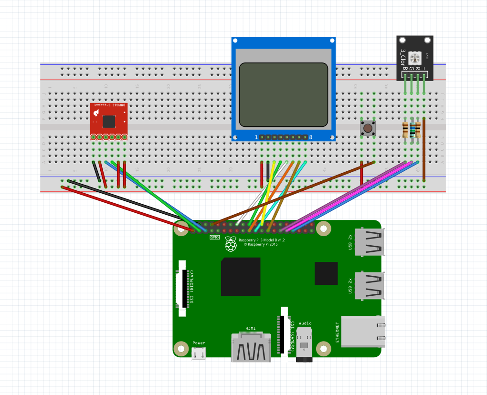

# Setup
You might I asked yourself how this project was done and what you need to do to run it. This page will help you with that.
Keep in mind that it's a rough guide for experienced users rather than a step-by-step tutorial. If you encounter any problems, you can [contact me](https://clemenskoprolin.com/contactme/) per email.

## Hardware
### List of used components
Here is a list of all components that have been used for this project. Keep in mind that there are multiple version of these parts, therefore your chosen components might have other pin configurations.
- Raspberry Pi 4. It should not matter if you use the Raspberry Pi 3 instead, for example.
- Breadboard and cables. Of course, you can solder the components, too.
- BMP280 air temperature and pressure sensor. I used a version from [joy-it](https://joy-it.net/en/products/SEN-KY052).
- Monochrome Nokia 5110 LCD Display. Here's the variant from [joy-it](https://joy-it.net/en/products/SBC-LCD84x48).
- RGB LED with two 100 Ω and one 180 Ω resistor (I used a 165 Ω resistor instead because I hadn't a 180 Ω lying around) . Again, I used a LED from [joy-it](https://joy-it.net/files/files/Produkte/SEN-KitX40/SenX40Kit_en.pdf#page=37).
- A push-button of your choice.

### Design
Here is a blueprint of the device:



| Pin of Raspberry Pi ¹ | Connected part  | Pin of the connected part ² |
| ------- | --- | --- |
| 1 | Power rail on the breadboard | - |
| 3 | BMP280 | 5 |
| 5 | BMP280 | 3 |
| 6 | Ground rail on the breadboard | - |
| 8 | Push button | 2 |
| 16 | LCD Display | 5 |
| 18 | LCD Display | 4 |
| 19 | LCD Display | 6 |
| 21 | LCD Display | 8 |
| 23 | LCD Display | 7 |
| 24 | LCD Display | 3 |
| 29 | RGB LED | 2 |
| 31 | RGB LED | 1 |
| 33 | RGB LED | 3 |

¹ These are the pin numbers that can be found at the [official website](https://www.raspberrypi.org/documentation/usage/gpio/). This isn't the GPIO numbering.

² Left to right seen from above. The same orientation as shown in the picture above.

## Software
I chose Raspberry Pi OS as the operating system for my Raspberry Pi. In order to use the project, you will need to update and download the necessary modules.
```sh
sudo apt update #Updates the package list
sudo apt install git python3-pip screen #Installs git, pip and screen, if these aren't already installed

sudo pip3 install adafruit-circuitpython-bmp280 #Installs the Adafruit CircuitPython BMP280 library
sudo pip3 install adafruit-circuitpython-pcd8544 #Installes the library for the display 
```

Now it's time to clone this GitHub repository to your Raspberry Pi.
```sh
git clone https://github.com/clemenskoprolin/airinfo-pi.git
chmod +x airinfo-pi/python/airinfo.sh
```

### MariaDB or MySQL

You'll need to create a MariaDB (or MySQL) database with the following command. You have to install MariaDB or MySQL in beforehand.

```sh
cd airinfo-pi
mysql -u root -p -e "CREATE DATABASE IF NOT EXISTS airinfo DEFAULT CHARACTER SET utf8 COLLA
TE utf8_general_ci;" #Creates the database
mysql -u root -p airinfo < airinfo-db.sql #Importing a sql-file into the database

mysql -u root -p -e "CREATE USER 'airinfo'@'localhost' IDENTIFIED BY '123456'; GRANT ALL PRIVILEGES ON airinfo.* TO 'airinfo'@'localhost';" #It would be a good idea to replace '123456' with a password of your choice
#Creates the user airinfo with the privileges for the database airinfo
```

If you replaced the password, you must change it in the following files, too:

```webserver/api/config.php```<br>
The line starts with ```define("db_password","123456");```

```python/v1/speicherung.py```<br>
The line starts with ```password="123456",```


### Webserver

After that, you need to configure your Raspberry Pi as a web server. There multiple choices here, but I recommend nginx or Apache. Once that's done, enable PHP to work with your web server. Then copy the webserver directory of this repository to your webserver (root) directory.

```sh
sudo cp -R webserver/* /var/www/html #Default webserver directory of Apache and nginx
sudo chmod -R 755 /var/www/ #Makes the files available for other users
sudo chown -R www-data:www-data /var/www #Makes www-data the owner of these files
```

### It's time!

Last, but not least, it's time to start the Python script.
```sh
./python/airinfo.sh
```
This creates an screen that can be accessed by running the following command:
```sh
screen -x airinfo
```
It can be stopped there by pressing multiple times CMD + C.